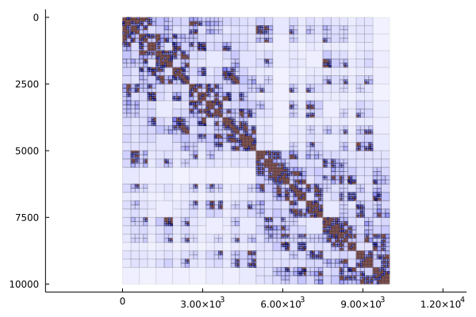

# HMatrices.jl

*A package for assembling and factoring hierarchical matrices*

[](https://WaveProp.github.io/HMatrices.jl/stable)
[](https://WaveProp.github.io/HMatrices.jl/dev)
[](https://github.com/WaveProp/HMatrices.jl/actions)
[](https://codecov.io/gh/WaveProp/HMatrices.jl)


## Installation
Install from the Pkg REPL:
```
pkg> add https://github.com/WaveProp/HMatrices.jl
```

## Overview

This package provides some functionality for assembling as well as for doing
linear algebra with [hierarchical
matrices](https://en.wikipedia.org/wiki/Hierarchical_matrix) with a strong focus
in applications arising in **boundary integral equation** methods. 

For the purpose of illustration, let us consider an abstract matrix `K` with
entry `i,j` given by the evaluation of some *kernel function* `G` on points
`X[i]` and `Y[j]`, where `X` and `Y` are vector of points (in 3D here); that is,
`K[i,j]=G(X[i],Y[j])`. This object can be constructed as follows:

```julia
using HMatrices, LinearAlgebra, StaticArrays
const Point3D = SVector{3,Float64}
# sample some points on a sphere
m = 100_000
X = Y = [Point3D(sin(θ)cos(ϕ),sin(θ)*sin(ϕ),cos(θ)) for (θ,ϕ) in zip(π*rand(m),2π*rand(m))]
function G(x,y) 
  d = norm(x-y) + 1e-8
  1/(4π*d)
end
K = KernelMatrix(G,X,Y)
```

where we took `G` to be the free-space Greens function of Laplace's
equation in 3D (to avoid division-by-zero we added `1e-8` to the distance
between points).

The object `K` corresponds to a dense matrix, so converting it to a matrix can
be costly both in terms of memory and flops. Instead, we can construct an
approximation to `K` as a hierarchical matrix using:

```julia
H = assemble_hmat(K;atol=1e-6)
```

> **Tip**: For a smaller problem size (say `m=10_000`), you may try 
> ```julia
> using Plots
> plot(H)
> ```
> to visualize the underlying block-structure. You should see something similar
> to the figure below:
>

Calling `HMatrices.compression_ratio(H)` reveals that storing a dense version of
`K` would take roughly `25` times as much space (and probably would not fit in
most laptops). We can now use `H` as an approximation to `K` for some linear
algebra operations, such as:

```julia
x = rand(m)
y = H*x
```

To check that this is indeed an approximation, we can compare against the exact
value at a given entry:

```julia
y[42] - sum(K[42,j]*x[j] for j in 1:m)
# about 2e-7
```

It is also possibly to factor `H` by calling e.g. `lu(H;atol=1e-6)` (this may
take a few minutes on a reasonable machine for the `100_000 × 100_000` problem
size and specified tolerance). The result is an `LU` factorization object with a
hierarchical low-rank structure, and the factored object can be used both in a
direct solver or as a preconditioner for `H` in an iterative solver.

For more information, see the [documentation](https://waveprop.github.io/HMatrices.jl/dev/).

## References and related packages

Below are some good references on hierarchical matrices and their application to
boundary integral equations:

[1] Hackbusch, Wolfgang. Hierarchical matrices: algorithms and analysis. Vol. 49. Heidelberg: Springer, 2015.

[2] Bebendorf, Mario. Hierarchical matrices. Springer Berlin Heidelberg, 2008.

If you are interested in hierarchical matrices and Julia, check out also the
following packages:

- [HierarchicalMatrices.jl](https://github.com/JuliaMatrices/HierarchicalMatrices.jl):
  a flexible framework for hierarchical matrices implementing an abstract
  infrastructure.
- [KernelMatrices.jl](https://bitbucket.org/cgeoga/kernelmatrices.jl): a library
  implementing the *Hierarchically Off-Diagonal Low-Rank* structure (HODLR).
- [HSSMatrices.jl](https://github.com/bonevbs/HssMatrices.jl): an implementation
  of the *Hierarchically semi-separable* structure (HSS).